# ☝ 13est : Best


## 🌎 Proejct : Best Place

  <div align="center"></div>


## 📚 Information

📅 개발 기간 | 2023. 09. 04 ~ 2023. 09. 24

📌 프로젝트 주제 | 맛집 예약/리뷰 서비스 - [네이버MY플레이스](https://m.place.naver.com/my/home) 클론 코딩

[📑발표자료]([https://](https://www.miricanvas.com/v/12flll1))

[🔗배포주소](https://13est-place.netlify.app/)


## 🤗 Team

Name | Profile |GitHub 
----- | ----- | -----
**김규민** |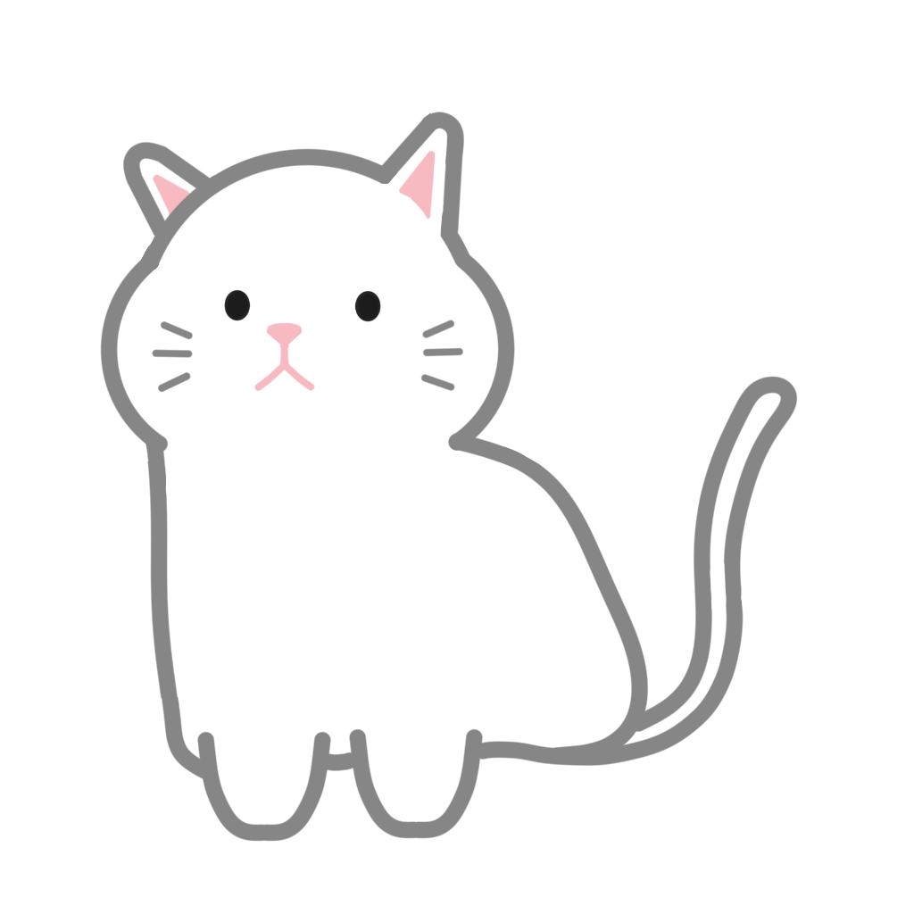 | https://github.com/Engsheet
**백상호** | | https://github.com/bigCoDult
**신현주** | | https://github.com/shju0317
**차지훈** | | https://github.com/cfgop23


## 🚩 Goal

🔖 **깨끗하게!** 클린 코드! 다른 팀원도 잘 알아볼 수 있도록 가독성 좋은 코드로 작성하기

🔖 **즐겁게!** 시작부터 끝까지 불화 없이 서로 돕는 팀 분위기

🔖 **완성도 있게!** 양보다 질! 필요한 기능과 불필요한 기능을 판별 → 분량은 최적화, 완성도 있는 결과물 만들기


## 📐 Convention
  [📏 Coding Convention](https://github.com/FRONTENDSCHOOL6/13est-place/wiki/Coding-Convention)

  [📏 Commit Convention](https://github.com/FRONTENDSCHOOL6/13est-place/wiki/Commit-Convention)


## 🤗 Introduce

 지역별, 음식 카테고리별 식당 리뷰 컨텐츠 제공 및 예약/리뷰 서비스
 
 주요기능
  - 회원가입/로그인
  - 지역별, 음식 카테고리별 필터링
  - 관심지역 설정
  - 식당 예약
  - 리뷰 쓰기
  - 내 예약, 주문 확인
  - 관심 장소 저장
  

## 🔨 Stack

                      


## 🎨 Tools

     


## 👀 Preview

Page | Preview | Description 
----- | ----- | -----
로그인 | 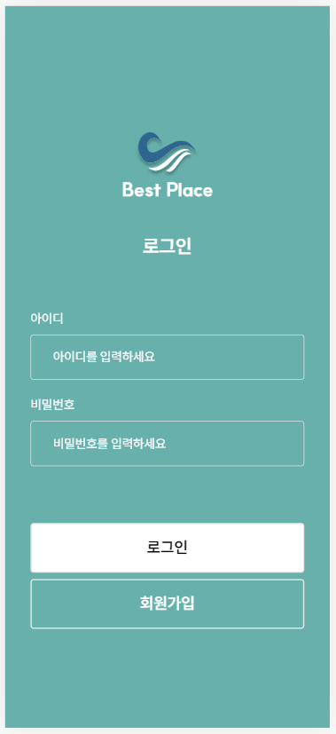 | 아이디/비밀번호 일치 확인
회원가입 | 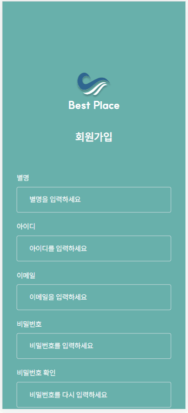 | 아이디/이메일/비밀번호 validation
프로필수정 | 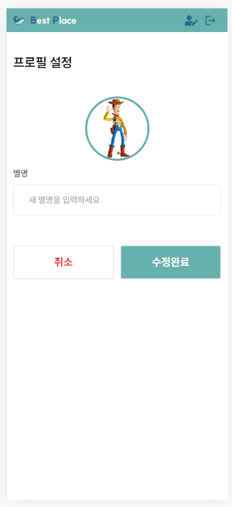 | 프로필 사진/닉네임 수정
팔로우 |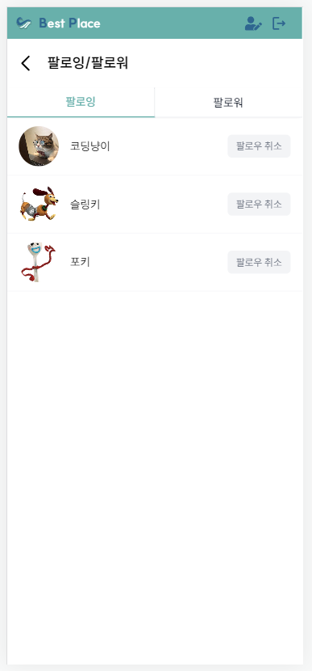 | 팔로잉, 팔로워 리스트
피드 | 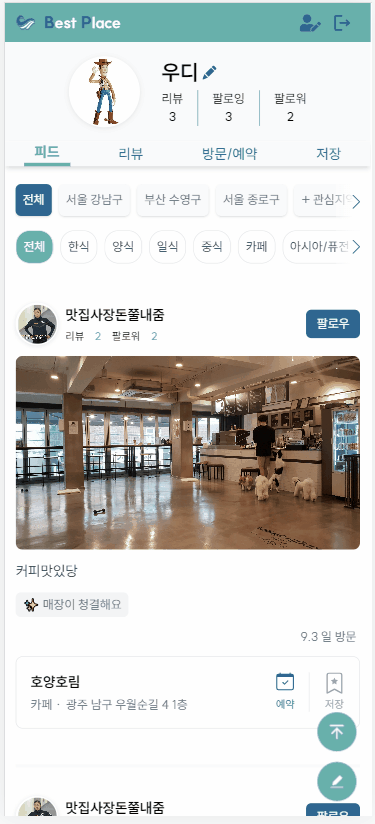 | 리뷰 정보 리스트<br/>지역별/음식카테고리별 필터링
리뷰 |  | 내가 쓴 리뷰 리스트
방문/예약 | 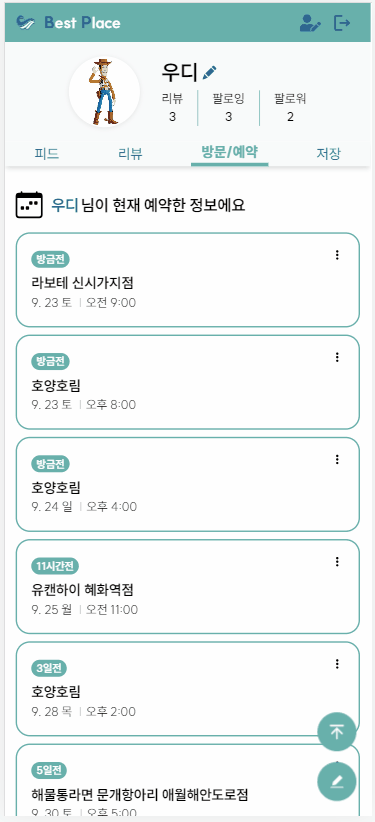 | 내가 방문/예약한 장소 리스트
저장 | 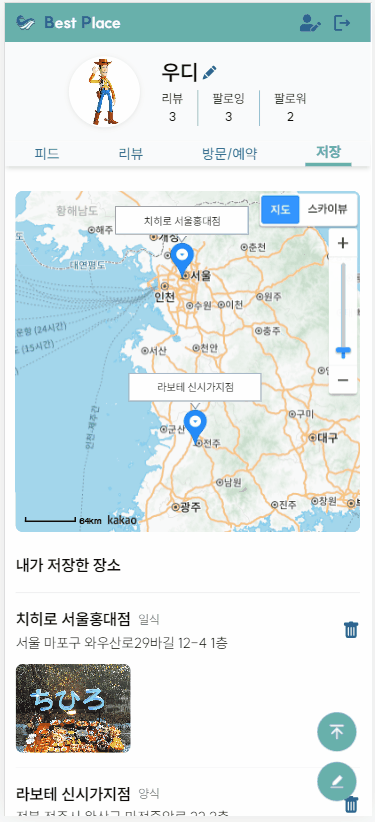 | 내가 저장한 장소 리스트
리뷰작성 | 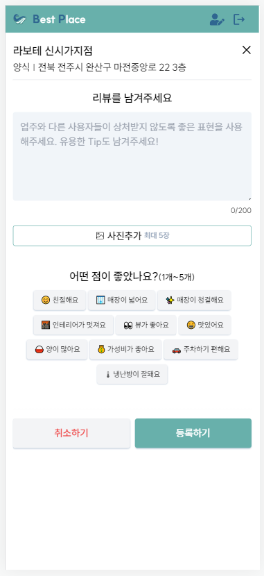 | 사진 수/키워드 수/공란 validation
예약작성 | 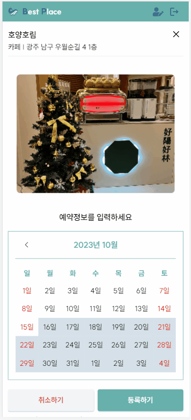 | 시간/인원/전화번호/이메일/공란 validation
에러페이지 | 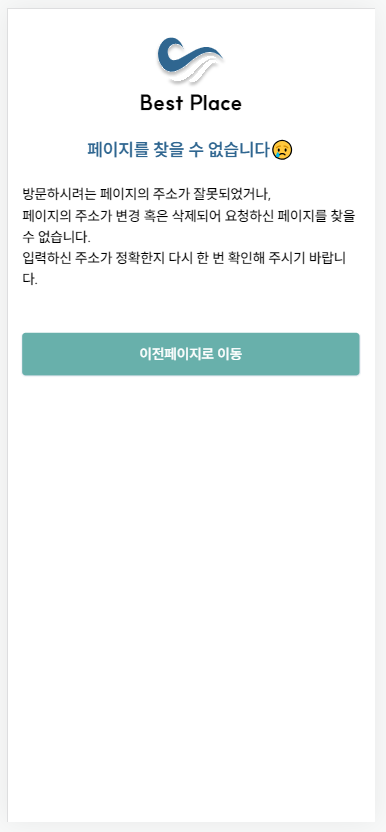 | 이전페이지로 이동


## ⏲ Performance inspection
<div align="center">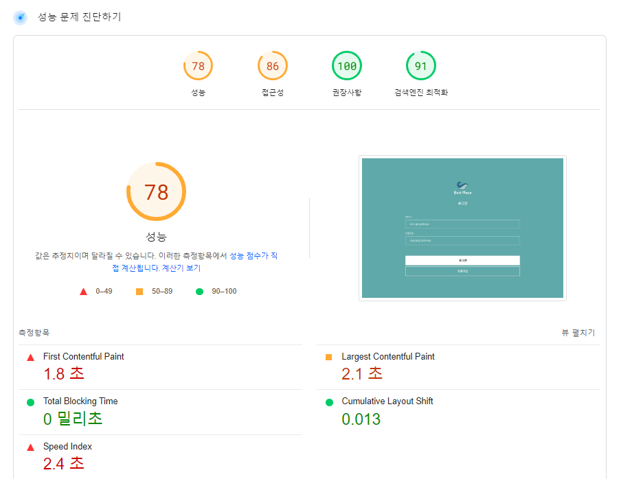</div>


## 💬 How to use?
  1️⃣ ```git clone https://github.com/FRONTENDSCHOOL6/13est-place.git``` 

  2️⃣ ```pnpm i```

  3️⃣ ```pnpm dev```
